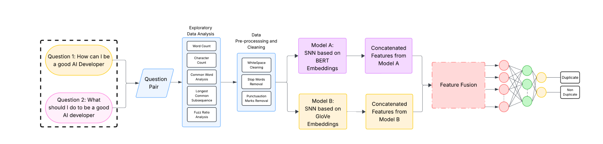
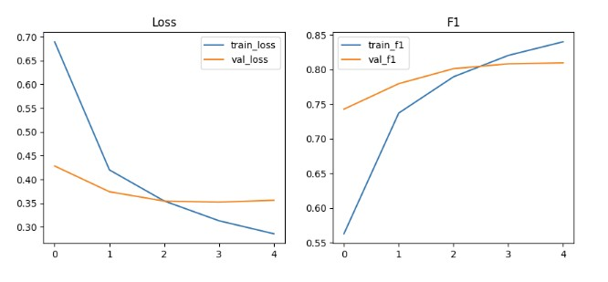
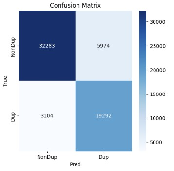

# Hybrid Siamese Network for Duplicate Question Detection

A deep learning framework for identifying semantically duplicate question pairs
in the Quora Question Pairs dataset. The proposed architecture fuses contextual
BERT representations, GloVe-based CNN–BiLSTM features, and handcrafted lexical
similarity features.

## Proposed Architecture



The framework contains two parallel Siamese branches:

- **Model A:** BERT embeddings followed by CNN, pooling, and recurrent feature extraction.
- **Model B:** GloVe embeddings followed by 1D-CNN, BiLSTM, and attention pooling.
- **Handcrafted features:** question length, word count, common-word statistics,
  longest-common-subsequence similarity, and fuzzy matching scores.
- **Feature fusion:** representations from both questions and all feature groups
  are concatenated and classified as duplicate or non-duplicate.

## Results

The reported validation performance is:

| Metric | Score |
|---|---:|
| Validation accuracy | 0.8503 |
| Positive-class F1-score | 0.8095 |
| Weighted F1-score | 0.8519 |
| Macro F1-score | 0.8431 |





## Repository Structure

```text
quora-duplicate-question-detection/
├── assets/
│   ├── architecture/
│   └── results/
├── data/
├── models/
├── notebooks/
│   └── hybrid_siamese_quora.ipynb
├── src/
│   ├── __init__.py
│   ├── features.py
│   └── model.py
├── .gitignore
├── LICENSE
├── README.md
└── requirements.txt
```

## Dataset

The project uses the **Quora Question Pairs** dataset. Each record contains:

- `question1`
- `question2`
- `is_duplicate` where `1` denotes a duplicate pair and `0` denotes a
  non-duplicate pair

Download the dataset from Kaggle and place `questions.csv` inside `data/`.
The dataset is intentionally excluded from Git because of its size and
licensing conditions.

## Installation

```bash
git clone https://github.com/YOUR_USERNAME/quora-duplicate-question-detection.git
cd quora-duplicate-question-detection

python -m venv .venv
```

Activate the environment:

```bash
# Windows
.venv\Scripts\activate

# Linux/macOS
source .venv/bin/activate
```

Install dependencies:

```bash
pip install -r requirements.txt
```

Download the required NLTK resources:

```python
import nltk
nltk.download("punkt")
nltk.download("punkt_tab")
```

## Kaggle Authentication

Do not place a Kaggle username or API key inside the notebook. Store
`kaggle.json` in the standard Kaggle configuration directory or use
environment variables.

```text
Linux/macOS: ~/.kaggle/kaggle.json
Windows:     C:\Users\<username>\.kaggle\kaggle.json
```

## Running the Project

Start Jupyter:

```bash
jupyter lab
```

Open:

```text
notebooks/hybrid_siamese_quora.ipynb
```

Update `DATA_PATH` in the notebook to:

```python
DATA_PATH = "../data/questions.csv"
```

To use pretrained GloVe vectors, download `glove.6B.100d.txt`, keep it outside
version control, and set:

```python
USE_GLOVE = True
GLOVE_PATH = "../data/glove.6B.100d.txt"
```

## Training Configuration

The supplied experiment used a hybrid BERT/GloVe Siamese architecture with
cross-entropy loss, AdamW optimization, learning-rate scheduling, gradient
clipping, and validation F1-based checkpoint selection. The attached final
experiment log reports batch size 32 and learning rate `1e-5`.

## Security Note

An API credential was removed from the original notebook while preparing this
repository. Revoke and regenerate any credential that was previously exposed
in a notebook, message, or public repository.

## Citation

When this work is published, add the manuscript citation here:

```bibtex
@article{junaid2026hybrid,
  title   = {Hybrid Siamese Network for Duplicate Question Detection},
  author  = {Muhammad Junaid and Co-authors},
  journal = {To be added},
  year    = {2026}
}
```

## License

This repository is released under the MIT License. Dataset and pretrained-model
licenses remain governed by their original providers.
